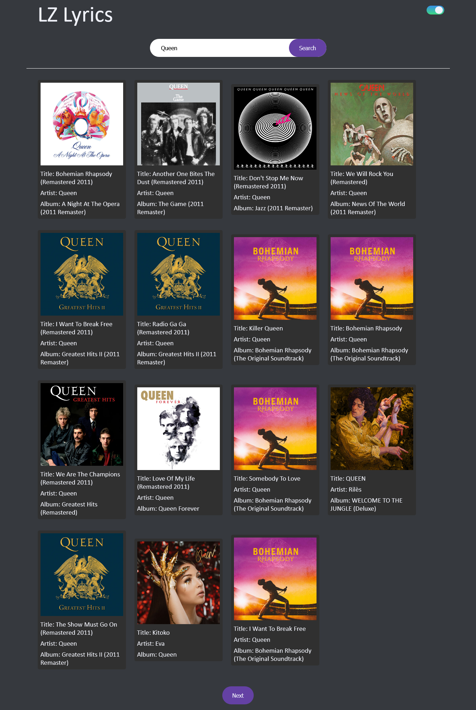
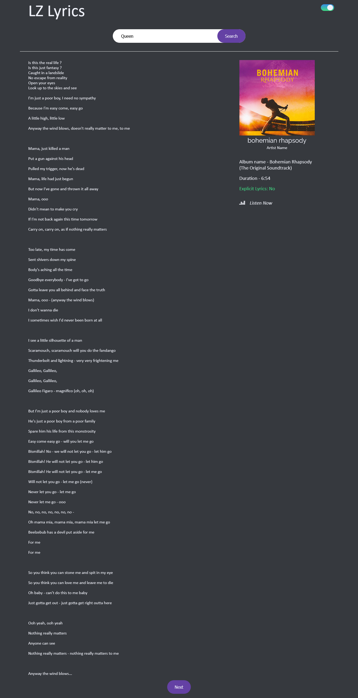

# LZ LYRICS APP

## Welcome! 👋

Thanks for checking out this small project.

## Table of contents

- [Overview](#overview)
  - [The Project](#the-project)
  - [Screenshot](#screenshot)
  - [Links](#links)
- [My process](#my-process)
  - [Built with](#built-with)
  - [Continued development](#continued-development)
- [Author](#author)
- [Acknowledgments](#acknowledgments)

## Overview

## The Project

The attempt was to build a fairly primitive but functional music lyric app to try and solidify my fetch api skills. It's unassuming but it works and I'm proud of it, and if I were to find an API with more data that I can use, I just might update it.

### Screenshot

### Links

- GitHub Repo: [https://github.com/ChinyangaTL/lz-lyrics](https://github.com/ChinyangaTL/lz-lyrics)
- Live Site URL: [https://www.chinyangatl/github.io/lz-lyrics](https://www.chinyangatl/github.io/lz-lyrics)

## My process

### Built with

- Semantic HTML5 markup
- CSS custom properties
- Flexbox
- Mobile-first workflow
- Vanilla JS
- Fetch API

### Continued development

Perhaps an update might see a more polished UI, use of a faster API, and more data provided; something closer to Genius.

## Author

- GitHub - [https://github.com/ChinyangaTL](https://github.com/ChinyangaTL)

## Acknowledgments

Generally Brad Traversy and Jonas Schmedtmann and their various tutorials that have taught me most of what I know.
